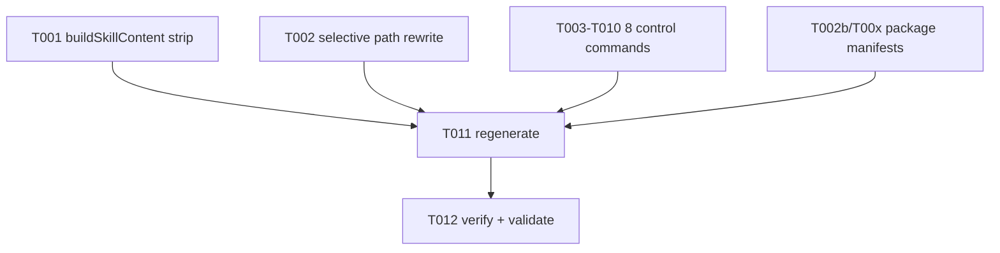

# Tasks: Plugin Directory Submission Fixes

## Overview

- Total tasks: 12 (10 edit + 1 regenerate + 1 verify)
- Edit sites: 2 generators + 8 control-command sources (top-level `.specify/` only)
- All edit tasks (T001–T010) must complete before regeneration (T011); verify (T012) last.
- **NEVER hand-edit generated output** (`plugins/eai-gofer/`, `.claude/`, `.github/prompts/`, `.gemini/`, `.system/`, `.agents/`). Only edit `.specify/commands/*.md` sources and `.specify/scripts/node/*.mjs` generators.

## Dependencies

## Phase 1 — generate-commands.mjs: SKILL double-frontmatter (FR-2)

Goal: each generated SKILL.md has exactly one frontmatter block.

- [X] T001 In `.specify/scripts/node/generate-commands.mjs` `buildSkillContent()` (~line 421): before wrapping, run `body` through existing `splitMarkdownFrontmatter()` and use the stripped body. **RISK GUARD:** apply ONLY here — `emitClaude()` must keep the embedded body frontmatter for Claude command output.

Verification: `node` run later; grep SKILL.md for a single `^---` pair.

## Phase 2 — generate-commands.mjs: selective ${CLAUDE_PLUGIN_ROOT} rewrite (FR-6)

Goal: only `.specify/scripts/` + `.specify/templates/` refs become `${CLAUDE_PLUGIN_ROOT}/...`; `specs|memory|logs` untouched; idempotent.

- [X] T002 In `.specify/scripts/node/generate-commands.mjs`, add a `SHIPPED_ASSET_RE` rewrite helper: replace `/(?<!\$\{CLAUDE_PLUGIN_ROOT\}\/)\.specify\/(scripts|templates)\//g` → `'${CLAUDE_PLUGIN_ROOT}/.specify/$1/'`. Apply to the body in `emitClaude()` (before write) and inside `buildSkillContent()` (after frontmatter strip). Do NOT apply in `emitGemini` (uses `{{include:}}`) or Copilot (inlined) — out of scope.

Verification: grep generated `.claude/commands` + skills for rewritten scripts/templates; confirm specs/memory/logs remain bare.

## Phase 3 — 8 control-command sources: embedded frontmatter (FR-1)

Goal: each of the 8 control commands emits Claude frontmatter with a description. Edit ONLY the top-level `.specify/commands/*.md`. Add an embedded `---\ndescription: "<canonical>"\n---` block at the very top of the body (after the outer stage frontmatter), matching the pipeline-command pattern. Descriptions from `canonical-descriptions.mjs`.

- [X] T003 `.specify/commands/gofer_plan.md` — "Toggle plan mode in the active CLI session for the next user prompt; non-pipeline control command." (use exact CANONICAL_DESCRIPTIONS value)
- [X] T004 `.specify/commands/gofer_side.md` — exact canonical description
- [X] T005 `.specify/commands/gofer_personality.md` — exact canonical description
- [X] T006 `.specify/commands/gofer_vocabulary.md` — "Extract domain terminology into a canonical feature glossary."
- [X] T007 `.specify/commands/gofer_zoom_out.md` — "Show how the current feature connects to broader system boundaries."
- [X] T008 `.specify/commands/gofer_spec_summary.md` — "Generate a business-friendly summary of feature value and scope."
- [X] T009 `.specify/commands/gofer_tdd.md` — "Guide a red-green-refactor loop tied to spec acceptance criteria."
- [X] T010 `.specify/commands/gofer_diagnose.md` — "Run a reproduce-minimize-instrument-fix loop for bugs and failing tests."

Note: T003–T010 are [P] parallel-safe (independent files). Pull each description verbatim from `CANONICAL_DESCRIPTIONS` at edit time to avoid drift.

## Phase 4 — package-agent-plugin.mjs: manifests + LICENSE (FR-3/4/5)

Goal: marketplace + plugin manifests validate clean; LICENSE shipped.

- [X] T011a In `.specify/scripts/node/package-agent-plugin.mjs`: remove top-level `description` key from `buildRepoMarketplace()` (~line 218; keep `metadata.description` ~line 224) AND `buildCodexLocalMarketplace()`. (FR-3)
- [X] T011b Remove `category` + `tags` from `buildPluginManifest()` (~lines 159–160) **and** `buildClaudeManifest()` (~lines 167–185). (FR-4)
- [X] T011c Add `'LICENSE'` to the `copiedResources` array in `writePluginFolder()` (~line 394), sourced from repo-root `LICENSE`. (FR-5)

## Phase 5 — Regenerate + Verify

- [X] T011 Regenerate all surfaces: `npm run gofer:generate` then `npm run gofer:package-plugin -- --sync-repo` (from gofer repo root). This is the ONLY way generated output + `plugins/eai-gofer/` get the fixes.
- [X] T012 Verify (all must pass):
  - FR-3/4: `claude plugin validate .claude-plugin/marketplace.json` and `.claude-plugin/plugin.json` → 0 errors, no description/category/tags issues. Repeat for `plugins/eai-gofer/.claude-plugin/*`.
  - FR-1: each of the 8 `plugins/eai-gofer/commands/gofer_*.md` starts with `---` frontmatter containing `description:`.
  - FR-2: every `plugins/eai-gofer/skills/*/SKILL.md` has exactly one `---...---` block (grep count == 2 `^---` lines).
  - FR-5: `test -f plugins/eai-gofer/LICENSE`.
  - FR-6: in `plugins/eai-gofer/commands/*.md`, `.specify/scripts` + `.specify/templates` refs show `${CLAUDE_PLUGIN_ROOT}/`; `.specify/specs|memory|logs` remain bare.

## Implementation Strategy

MVP = all 6 FRs (the submission bar is all-or-nothing for validation). Order: edits (T001–T010, T011a–c) → regenerate (T011) → verify (T012). Rollback: `git checkout` the 2 generators + 8 sources; regeneration is deterministic so re-running restores prior state.

## Traceability

| FR | Tasks | Phase |
|----|-------|-------|
| FR-1 (8 control cmd frontmatter) | T003–T010 | 3 |
| FR-2 (SKILL single frontmatter) | T001 | 1 |
| FR-3 (marketplace description) | T011a | 4 |
| FR-4 (plugin.json category/tags) | T011b | 4 |
| FR-5 (LICENSE shipped) | T011c | 4 |
| FR-6 (selective path rewrite) | T002 | 2 |
| (all) regenerate + validate | T011, T012 | 5 |

6/6 FRs covered.
